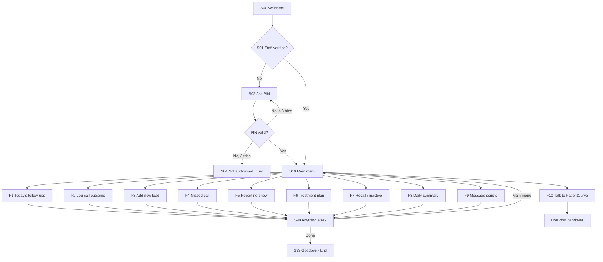

# PatientCurve Staff Chatflow (BotPenguin build guide)

This is the staff-side companion to the patient chatflow. Patients use their bot to enquire and book. Clinic staff (front desk, coordinators, doctors) use this bot to log what happens on their side, so every opportunity enters the follow-up system:

- new enquiries taken by phone or at the desk
- missed calls
- no-shows
- treatment plans that weren't booked
- patients due for recall
- outcomes of follow-up calls

Like the patient flow, it follows one pattern: **welcome → identify → menu → collect details → confirm → save → back to menu or hand over to a human.**

---

## 1. Overview

### Where staff reach it
Pick one:

| Option | When to use it |
| --- | --- |
| **Separate staff bot (recommended)** | A second WhatsApp number or a private website widget just for staff. This keeps the patient bot clean. |
| Keyword inside the patient bot | Only if you have one number. Add a trigger keyword such as `staff` that jumps to **S01**. The PIN check (S02) then becomes mandatory, because anyone can type the keyword. |

---

## 2. Before you build: set up these first

### 2.1 Custom attributes
Create these in BotPenguin (**Settings → Attributes / Custom attributes**; the menu name varies by plan). The flow saves answers into them.

| Attribute | Type | Filled by |
| --- | --- | --- |
| `staff_name` | Text | Staff lookup / S03 |
| `staff_role` | Text | Staff lookup (Front desk / Coordinator / Doctor / Manager) |
| `clinic_id` | Text | Staff lookup |
| `staff_verified` | Text (`yes`/`no`) | Staff lookup / S02 |
| `pin_attempts` | Number | S02 |
| `pt_name` | Text | Patient name in any form |
| `pt_phone` | Phone | Patient phone in any form |
| `pt_source` | Text | F3: Phone call / Walk-in / Instagram / Google / Referral / Other |
| `pt_interest` | Text | F3, F6: treatment or service |
| `pt_preferred_time` | Text | F3, F5 |
| `appt_date` | Date | F5, F7 |
| `treatment_value` | Number | F6 (optional, estimated value) |
| `outcome` | Text | F2 |
| `next_action_date` | Date | F2 |
| `notes` | Text | All forms (optional) |
| `record_type` | Text | Set by each flow: `new_lead`, `missed_call`, `no_show`, `treatment`, `recall`, `call_outcome` |

### 2.2 Data store (Google Sheet)
Create one Google Sheet with these tabs and header rows:

| Tab | Columns |
| --- | --- |
| `Staff` | `phone`, `pin`, `staff_name`, `staff_role`, `clinic_id`, `active` |
| `Opportunities` | `timestamp`, `record_type`, `clinic_id`, `staff_name`, `pt_name`, `pt_phone`, `pt_source`, `pt_interest`, `pt_preferred_time`, `appt_date`, `treatment_value`, `notes`, `status` |
| `CallLog` | `timestamp`, `clinic_id`, `staff_name`, `pt_phone`, `outcome`, `next_action_date`, `notes` |

**Writing rows:** connect BotPenguin's **Google Sheets** integration and add rows to `Opportunities` / `CallLog`. Map each column to an attribute.

**Reading data** (staff lookup, today's follow-ups, daily summary): BotPenguin needs an **API Request / Webhook** node for this (check that your plan includes it). Point it at a small endpoint, such as an n8n workflow or a Google Apps Script web app, that reads the sheet and returns JSON. Section 5 lists the three endpoints.

### 2.3 WhatsApp limits to respect
- Reply buttons: at most **3** per message, title ≤ **20** characters.
- List message: at most **10** rows, row title ≤ **24** characters, and a button label (for example "Open menu").
- Every label in this guide already fits these limits.

---

## 3. Node-by-node build

Notation: **Type** is the BotPenguin component to drag in. "→" is the next node. Text in `{{ }}` is an attribute; insert it with BotPenguin's attribute picker.

### 3.1 Entry and verification

| ID | Type | Content | Save to | Next |
| --- | --- | --- | --- | --- |
| S00 | Message | "Hi 👋 This is the PatientCurve staff assistant. I help you log patients so nobody misses a follow-up." | – | S01 |
| S01 | API Request | `POST /staff/lookup` with `{ "phone": "{{user_phone}}" }`. Map the response to `staff_verified`, `staff_name`, `staff_role`, `clinic_id`. | see left | Condition: `staff_verified = yes` → S10, else → S02 |
| S02 | Ask question (number) | "Please enter your 4-digit staff PIN." Increment `pin_attempts` by 1 (Set attribute). | `pin` (temporary) | API `POST /staff/lookup` with phone and PIN → Condition: verified → S10 · `pin_attempts < 3` → S02 · else → S04 |
| S03 | *(optional)* Ask name | Use only if you don't do a lookup: "What's your name?" | `staff_name` | S10 |
| S04 | Message → End | "Sorry, I couldn't verify you. Please ask your clinic manager to add your number in PatientCurve." | – | End chat |

> No API plan? Replace S01/S02 with a single **Condition** on a fixed PIN (for example `pin = 2468`) and ask for the name with S03. It's less secure, but enough for a pilot.

### 3.2 Main menu

| ID | Type | Content | Next |
| --- | --- | --- | --- |
| S10 | List message (single choice) | "Hi {{staff_name}}, what would you like to do?" · Button label: **Open menu** | per row |

| Row title (≤ 24 chars) | Row description | Goes to |
| --- | --- | --- |
| Today's follow-ups | Patients to contact today | F1 |
| Log a call outcome | Record what a patient said | F2 |
| Add a new lead | Phone, walk-in or DM enquiry | F3 |
| Report a missed call | We'll call or text them back | F4 |
| Report a no-show | We'll rebook them | F5 |
| Treatment not booked | Advised but not scheduled | F6 |
| Recall / inactive patient | Overdue check-up or cleaning | F7 |
| Today's summary | Your clinic's numbers today | F8 |
| What do I say? | Ready-made message scripts | F9 |
| Talk to PatientCurve | Get help from our team | F10 |

Also add a **fallback**: if the staff member types instead of tapping, reply "Please pick an option from the menu 👇" and return to S10.

### 3.3 F1 — Today's follow-ups

| ID | Type | Content | Save to | Next |
| --- | --- | --- | --- | --- |
| F1.1 | API Request | `GET /followups/today?clinic_id={{clinic_id}}`. It returns `count` and `list_text` (a pre-formatted list of up to 10 patients: name, reason, phone). | `fu_count`, `fu_list` | Condition: `fu_count = 0` → F1.2, else → F1.3 |
| F1.2 | Message | "🎉 No follow-ups due today. Great work!" | – | S90 |
| F1.3 | Message | "You have {{fu_count}} follow-ups today:\n\n{{fu_list}}\n\nAfter each call, tap **Log a call outcome** so we can schedule the next step." | – | F1.4 |
| F1.4 | Buttons | "Log an outcome now?" · **Log outcome** · **Main menu** | – | Log outcome → F2.1 · Main menu → S10 |

### 3.4 F2 — Log a call outcome

| ID | Type | Content | Save to | Next |
| --- | --- | --- | --- | --- |
| F2.1 | Ask phone | "Patient's phone number?" | `pt_phone` | F2.2 |
| F2.2 | List message | "What happened?" · rows: **Booked** · **Will call back** · **Not interested** · **No answer** · **Wrong number** · **Already treated elsewhere** | `outcome` | Booked → F2.3 · Will call back → F2.4 · No answer → F2.6 · others → F2.5 |
| F2.3 | Ask date | "Appointment date?" | `appt_date` | F2.5 |
| F2.4 | Ask date | "When should we follow up again?" | `next_action_date` | F2.5 |
| F2.6 | Set attribute | `next_action_date` = tomorrow (or leave it blank and let the backend decide) | – | F2.5 |
| F2.5 | Ask question (optional, allow "skip") | "Any notes? Type *skip* if none." | `notes` | F2.7 |
| F2.7 | Set attribute → Google Sheets (add row to `CallLog`) | `record_type = call_outcome` | – | F2.8 |
| F2.8 | Message | "✅ Saved. {{pt_phone}} → {{outcome}}." | – | S90 |

### 3.5 F3 — Add a new lead (phone, walk-in, DM)

| ID | Type | Content | Save to | Next |
| --- | --- | --- | --- | --- |
| F3.1 | Ask name | "Patient's name?" | `pt_name` | F3.2 |
| F3.2 | Ask phone | "Their phone number? (with country code)" | `pt_phone` | F3.3 |
| F3.3 | List message | "How did they reach you?" · **Phone call** · **Walk-in** · **Instagram / Facebook** · **Google** · **Referral** · **Other** | `pt_source` | F3.4 |
| F3.4 | List message | "What are they interested in?" · **Check-up / cleaning** · **Implants** · **Braces / aligners** · **Whitening** · **Root canal** · **Crown / bridge** · **Tooth pain** · **Other** | `pt_interest` | F3.5 |
| F3.5 | Buttons | "When would they like to come in?" · **This week** · **Next week** · **Not sure** | `pt_preferred_time` | F3.6 |
| F3.6 | Ask question (optional) | "Any notes? Type *skip* if none." | `notes` | F3.7 |
| F3.7 | Buttons (confirm) | "Please confirm:\n👤 {{pt_name}}\n📞 {{pt_phone}}\n🦷 {{pt_interest}}\n📍 {{pt_source}}\n🗓 {{pt_preferred_time}}" · **Save** · **Edit** · **Cancel** | – | Save → F3.8 · Edit → F3.1 · Cancel → S10 |
| F3.8 | Set attribute → Google Sheets (add row to `Opportunities`, `status = new`) | `record_type = new_lead` | – | F3.9 |
| F3.9 | Message | "✅ Lead saved. PatientCurve will follow up with {{pt_name}} shortly." | – | S90 |

### 3.6 F4 — Report a missed call

| ID | Type | Content | Save to | Next |
| --- | --- | --- | --- | --- |
| F4.1 | Ask phone | "Number that called?" | `pt_phone` | F4.2 |
| F4.2 | Ask name (optional) | "Name, if you know it. Type *skip* if not." | `pt_name` | F4.3 |
| F4.3 | Buttons | "When did they call?" · **Just now** · **Earlier today** · **Yesterday** | `notes` | F4.4 |
| F4.4 | Set attribute → Google Sheets (`Opportunities`, `status = new`) | `record_type = missed_call` | – | F4.5 |
| F4.5 | Message | "✅ Got it. We'll message {{pt_phone}} so they don't book elsewhere." | – | S90 |

### 3.7 F5 — Report a no-show

| ID | Type | Content | Save to | Next |
| --- | --- | --- | --- | --- |
| F5.1 | Ask name | "Patient's name?" | `pt_name` | F5.2 |
| F5.2 | Ask phone | "Phone number?" | `pt_phone` | F5.3 |
| F5.3 | Ask date | "Date of the missed appointment?" | `appt_date` | F5.4 |
| F5.4 | List message | "What was it for?" · same rows as F3.4 | `pt_interest` | F5.5 |
| F5.5 | Buttons | "Should we try to rebook them?" · **Yes, rebook** · **No, skip** | – | Yes → F5.6 · No → S90 |
| F5.6 | Set attribute → Google Sheets (`Opportunities`, `status = new`) | `record_type = no_show` | – | F5.7 |
| F5.7 | Message | "✅ Saved. We'll contact {{pt_name}} today to rebook." | – | S90 |

### 3.8 F6 — Treatment not booked

| ID | Type | Content | Save to | Next |
| --- | --- | --- | --- | --- |
| F6.1 | Ask name | "Patient's name?" | `pt_name` | F6.2 |
| F6.2 | Ask phone | "Phone number?" | `pt_phone` | F6.3 |
| F6.3 | List message | "Treatment advised?" · **Implants** · **Braces / aligners** · **Root canal** · **Crown / bridge** · **Extraction** · **Whitening** · **Gum treatment** · **Other** | `pt_interest` | F6.4 |
| F6.4 | Ask number (optional) | "Estimated treatment value? Type *0* to skip." | `treatment_value` | F6.5 |
| F6.5 | Buttons | "Why didn't they book?" · **Cost** · **Wants to think** · **Timing** | `notes` | F6.6 |
| F6.6 | Set attribute → Google Sheets (`Opportunities`, `status = new`) | `record_type = treatment` | – | F6.7 |
| F6.7 | Message | "✅ Saved. We'll follow up with {{pt_name}} about their {{pt_interest}}." | – | S90 |

### 3.9 F7 — Recall / inactive patient

| ID | Type | Content | Save to | Next |
| --- | --- | --- | --- | --- |
| F7.1 | Ask name | "Patient's name?" | `pt_name` | F7.2 |
| F7.2 | Ask phone | "Phone number?" | `pt_phone` | F7.3 |
| F7.3 | Buttons | "Last visit?" · **6–12 months ago** · **Over a year ago** · **Not sure** | `notes` | F7.4 |
| F7.4 | Buttons | "What are they due for?" · **Check-up** · **Cleaning** · **Treatment review** | `pt_interest` | F7.5 |
| F7.5 | Set attribute → Google Sheets (`Opportunities`, `status = new`) | `record_type = recall` | – | F7.6 |
| F7.6 | Message | "✅ Added to recall. We'll send {{pt_name}} a friendly reminder." | – | S90 |

> Have many recall patients? Don't enter them one by one. Choose **Talk to PatientCurve** and ask for a bulk upload from your patient list.

### 3.10 F8 — Today's summary

| ID | Type | Content | Save to | Next |
| --- | --- | --- | --- | --- |
| F8.1 | API Request | `GET /summary/today?clinic_id={{clinic_id}}`. It returns `new_leads`, `followed_up`, `booked`, `no_shows`, `pending`. | same names | F8.2 |
| F8.2 | Message | "📊 Today at your clinic\n• New leads: {{new_leads}}\n• Followed up: {{followed_up}}\n• Booked: {{booked}}\n• No-shows: {{no_shows}}\n• Still pending: {{pending}}" | – | S90 |

Optional: show F8 only to managers. Before F8.1, add a Condition `staff_role = Manager`; otherwise show "Summary is available to managers" → S90.

### 3.11 F9 — What do I say? (scripts)

| ID | Type | Content | Next |
| --- | --- | --- | --- |
| F9.1 | List message | "Pick a situation:" · **New enquiry** · **Missed call** · **No-show** · **Treatment follow-up** · **Recall reminder** | the matching message below |
| F9.2 | Message (New enquiry) | "Hi [Name], thanks for contacting [Clinic]! We'd love to help with [treatment]. Would [Day] or [Day] suit you for a visit?" | F9.7 |
| F9.3 | Message (Missed call) | "Hi, this is [Clinic]. Sorry we missed your call! How can we help? You can reply here or call us back on [number]." | F9.7 |
| F9.4 | Message (No-show) | "Hi [Name], we missed you today at [Clinic]. No worries, these things happen! Shall we find a new time that suits you?" | F9.7 |
| F9.5 | Message (Treatment) | "Hi [Name], just checking in about the [treatment] Dr [Name] recommended. Any questions we can answer? We're happy to help you plan it." | F9.7 |
| F9.6 | Message (Recall) | "Hi [Name], it's been a while since your last check-up at [Clinic]. Would you like to book a quick visit this month?" | F9.7 |
| F9.7 | Buttons | "Need another script?" · **More scripts** · **Main menu** | More → F9.1 · Menu → S10 |

### 3.12 F10 — Talk to PatientCurve (human handover)

| ID | Type | Content | Save to | Next |
| --- | --- | --- | --- | --- |
| F10.1 | Ask question | "Briefly, what do you need help with?" | `notes` | F10.2 |
| F10.2 | Live chat / Human handover | Assign to the PatientCurve support team or inbox. Outside working hours, show: "Our team is offline. We'll reply by [time] tomorrow." | – | Handover |

### 3.13 Shared end nodes

| ID | Type | Content | Next |
| --- | --- | --- | --- |
| S90 | Buttons | "Anything else, {{staff_name}}?" · **Main menu** · **Done** | Main menu → S10 · Done → S99 |
| S99 | Message → End | "Thanks! Every patient you log is a patient we can bring back. 🦷" | End chat |

**Reset attributes:** at S10, add a **Set attribute** that clears `pt_name`, `pt_phone`, `pt_interest`, `pt_source`, `pt_preferred_time`, `appt_date`, `treatment_value`, `outcome`, `next_action_date`, `notes`. Otherwise one patient's details leak into the next entry.

---

## 4. Patient flow ↔ staff flow mapping

Use this to keep both bots consistent and feeding the same sheet.

| Opportunity type | Patient bot (patient does it) | Staff bot (staff logs it) | `record_type` |
| --- | --- | --- | --- |
| New leads | Patient enquires and books | F3 Add a new lead | `new_lead` |
| Missed leads | Patient messages after hours | F4 Missed call | `missed_call` |
| No-shows | Patient replies to the rebook message | F5 Report a no-show | `no_show` |
| Treatment follow-up | Patient replies to the treatment reminder | F6 Treatment not booked | `treatment` |
| Recall / inactive | Patient replies to the recall reminder | F7 Recall / inactive | `recall` |
| Booking outcome | Patient picks a slot | F2 Log a call outcome | `call_outcome` |

Use the **same treatment list** (F3.4) in both bots so reports group correctly.

---

## 5. Backend endpoints (for API Request nodes)

Build these in n8n or Google Apps Script. Each one reads the Google Sheet.

| Endpoint | Input | Returns |
| --- | --- | --- |
| `POST /staff/lookup` | `phone`, optional `pin` | `{ staff_verified, staff_name, staff_role, clinic_id }`. Match on `phone` (and `pin` if sent) where `active = yes`. |
| `GET /followups/today` | `clinic_id` | `{ count, list_text }`. Rows where `status = new` or `next_action_date = today`, formatted as `1. Name · reason · phone` per line, max 10. |
| `GET /summary/today` | `clinic_id` | `{ new_leads, followed_up, booked, no_shows, pending }` counted from today's rows. |

Protect them with a secret header (for example `x-api-key`) set in the BotPenguin API node.

---

## 6. Build order in BotPenguin

1. Create the bot (WhatsApp or Website) named **PatientCurve Staff**.
2. Create all attributes from section 2.1.
3. Connect Google Sheets and create the tabs from section 2.2. Add yourself to `Staff`.
4. Build **S00 → S01/S02 → S10** and the shared end nodes **S90 / S99** first. Test that the menu opens.
5. Build the write-only flows first (they need only Google Sheets): **F3, F4, F5, F6, F7, F2**.
6. Build **F9** (static messages) and **F10** (handover).
7. Build the API flows last: **F1, F8**, plus the lookup in S01.
8. Add the fallback on S10 and the attribute reset.
9. Run the test checklist below, then share the number or link with clinic staff.

## 7. Test checklist

- [ ] Unknown number → asked for PIN → 3 wrong PINs → S04 ends the chat.
- [ ] Known staff number → greeted by name → menu shows 10 rows.
- [ ] F3 full run → the confirm screen shows the right values → a row appears in `Opportunities` with `record_type = new_lead`.
- [ ] F3 **Edit** restarts the form; **Cancel** saves nothing.
- [ ] F2 for each outcome → `CallLog` row; **Booked** asks for a date, **Will call back** asks for a follow-up date.
- [ ] F4, F5, F6, F7 each write one row with the right `record_type`.
- [ ] After a save, start another entry → the old patient's data does **not** appear (reset works).
- [ ] F1 with no data → "No follow-ups"; with data → list shown.
- [ ] F8 as non-manager → blocked; as manager → numbers shown.
- [ ] Typing free text at the menu → fallback message → menu again.
- [ ] F10 reaches a live agent, and the offline message appears outside working hours.
